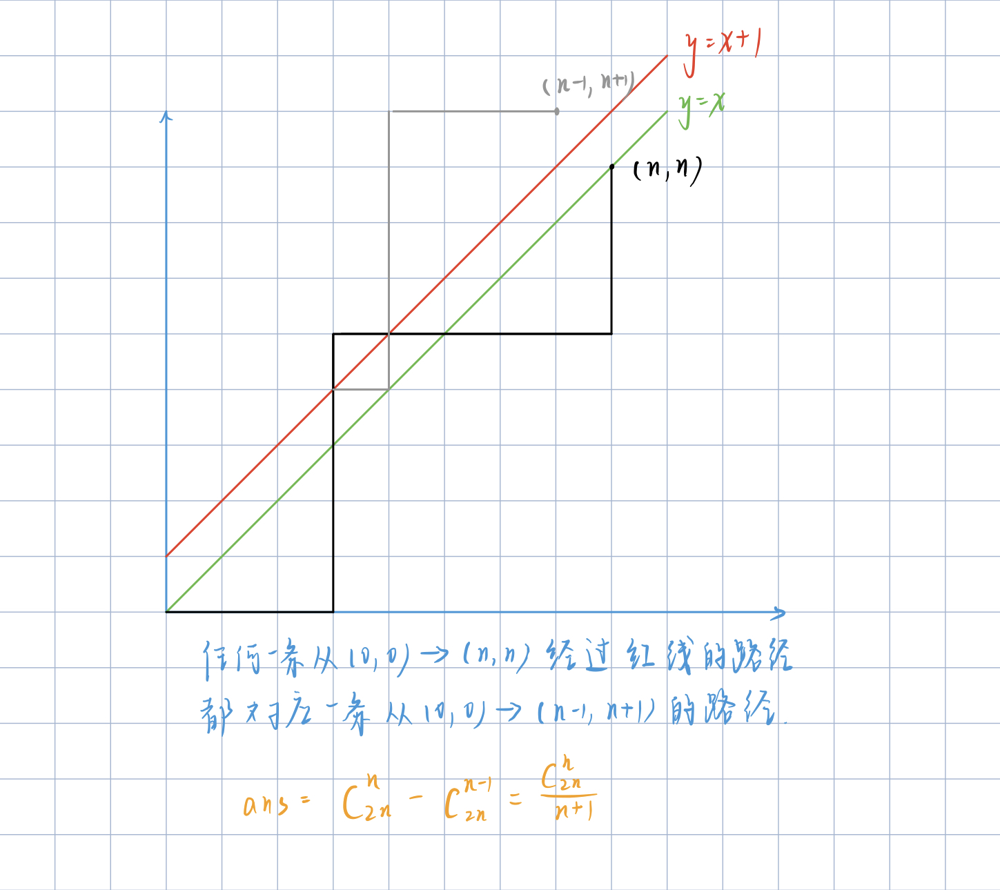

### Lesson3

> **高斯消元**
>
> 作用：
>
> * 可以在O(n^3)时间复杂度内求解一个包含n个方程n个未知数的多元线性方程组
>
>   解的三种情况
>
>   * 唯一解
>   * 无穷多组解
>   * 无解
>
> 矩阵的3种等价变换操作（初等行列变换，不会影响方程组的解）
>
> * 某一行乘一个非零的数 
>
> * 交换某两行
>
> * 把某行的若干倍加到另外一行之上
>
>   目的：**将增广矩阵变为上三角矩阵**
>
>   解的情况
>
>   * 唯一解：完美的阶梯型
>   * 无解：化简之后，存在方程左边无未知数，右边不为0（0 = 非零）
>   * 无穷多组解：化简之后，存在0 = 0情况的方程
>
> 算法步骤
>
> ```C++
> 枚举每一列c：
> 	找到该列绝对值最大的一行（出于精度考虑）
>     将该行换至当前最上面（没有被换到过）
>     将该行的第一个非零数变为1。（初等行变换）
>     将下面的所有行的第c列消为0
> 
> 判断解的情况，若有解则从最后一行的方程开始求解
> ```
>
> 具体实现：时间复杂度O(n^3)
>
> ```C++
> #include <iostream>
> #include <algorithm>
> #include <cmath>
> 
> using namespace std;
> 
> const int N = 110;
> const double eps = 1e-6;
> 
> int n;
> double a[N][N];
> 
> int gauss() {
>     int c, r;   //c表示列，r表示行
> 
>     for (c=0, r=0; c<n; c++) {
>         int t = r;
> 
>         //找出第c列绝对值最大的一行
>         for (int i=r; i<n; i++)
>             if (fabs(a[i][c]) > fabs(a[t][c]))
>                 t = i;
> 
>         //如果最大值是0，结束本次循环，跳到下一列
>         if (fabs(a[t][c]) < eps) continue;
> 
>         //将该行换至当前最上面
>         for (int i=c; i<n+1; i++) swap(a[t][i], a[r][i]);
>         //将该行第一个非零数化为1，注意行数已经变为r
>         for (int i=n; i>=c; i--) a[r][i] /= a[r][c];
> 
>         //将该行之下所有行的第c列消为0
>         for (int i=r+1; i<n; i++) 
>             if (fabs(a[i][c]) > eps)
>                 for (int j=n; j>=c; j--)
>                     a[i][j] -= a[r][j]*a[i][c]; //a[i][c]为乘的系数
> 
>         r++;
>     }
> 
>     if (r < n) {    //无穷多解或者无解
>         for (int i=r; i<n; i++)     //从第r行开始看
>             if (fabs(a[i][n]) > eps)
>                 return 2;   //0 = 非零，无解
> 
>         return 1;   // 无穷多组解
>     }
> 
>     //若有解则从最后一行的方程开始求解
>     for (int i=n-1; i>=0; i--)  //从最后一行开始
>         for (int j=i+1; j<n; j++)   
>             //最终结果为a[i][n]-主元外的所有系数a[i][j]*与系数对应的xj的值即a[j][n]
>             a[i][n] -= a[i][j]*a[j][n];
> 
>     return 0;   //唯一解
> }
> 
> int main(void) {
>     scanf("%d", &n);
> 
>     for (int i=0; i<n; i++)    //行
>         for (int j=0; j<n+1; j++)   //列，循环n+1次，a[i][n]存储等号右侧常数
>             scanf("%lf", &a[i][j]); //注意输入格式控制！
> 
>     int t = gauss();
> 
>     if (t == 0) {   //存在唯一解
>         for (int i=0; i<n; i++) printf("%.2f\n", a[i][n]);
>     }
>     else if (t == 1) puts("Infinite group solutions");
>     else puts("No solution");
> 
>     return 0;
> }
> ```
>
> * e2: 解异或线性方程组
>
>   异或：不进位加法
>
> ```C++
> #include <iostream>
> #include <algorithm>
> 
> using namespace std;
> 
> const int N = 110;
> 
> int n;
> int a[N][N];
> 
> int gauss() {
>     int c, r;
>     
>     for (c=0, r=0; c<n; c++) {
>         int t = r;
>         
>         for (int i=r; i<n; i++)
>             if (a[i][c]) {
>                 t = i;
>                 break;
>             }
>         
>         if (a[t][c] == 0) continue;
>         
>         for (int i=0; i<n+1; i++) swap(a[t][i], a[r][i]);
>         
>         for (int i=r+1; i<n; i++)
>             if (a[i][c])  
>                 for (int j=n; j>=c; j--)
>                     a[i][j] ^= a[r][j];     
>         r++;
>     }
>     
>     if (r < n) {
>         for (int i=r; i<n; i++)
>             if (a[r][n])
>                 return 2;
>         
>         return 1;
>     }
>     
>     for (int i=n-1; ~i; i--)
>         for (int j=i+1; j<n; j++)
>             //对非主元的每一项a[i][j]*a[j][n]，等式两边同时^a[i][j]*a[j][n]
>             //从而将该项消零
>             a[i][n] ^= a[i][j]*a[j][n];
>     
>     return 0;
> }
> 
> int main(void) {
>     scanf("%d", &n);
>     
>     for (int i=0; i<n; i++)
>         for (int j=0; j<n+1; j++)
>             scanf("%d", &a[i][j]);
>             
>     int t = gauss();
>     
>     if (!t)
>         for (int i=0; i<n; i++) printf("%d\n", a[i][n]);
>     else if (t == 1) puts("Multiple sets of solutions");
>     else puts("No solution");
>     
>     return 0;
> }
> ```
>
> 


> **组合数**
>
> 根据**数据范围**选择使用的算法
>
> **求组合数1**: 
>
> * 范围：
>
>   1 ≤ n ≤ 10000
>   1 ≤ b ≤ a ≤ 2000
>
> * 递推式：**C(a, b) = C(a-1, b) + C(a-1, b-1)**;
>
>   证明：
>
>   C(a, b)表示从a个苹果中选出b个的方案数
>
>   把所有选法分成两种情况：包含某一个苹果的选法C(a-1, b-1)，不包含某一个苹果的选法C(a-1, b)
>
> 具体实现：将所有组合数预处理出来（递推）时间复杂度O(n^2)
>
> ```C++
> #include <iostream>
> 
> using namespace std;
> 
> const int N = 2010, mod = 1e9+7;
> 
> int c[N][N];
> 
> void init() {
>     for (int i=0; i<N; i++)
>         for (int j=0; j<=i; j++)
>             if (!j) c[i][j] = 1;    //当j=0时，进行特判
>             else c[i][j] = (c[i-1][j-1]+c[i-1][j])%mod;
> }
> 
> int main(void) {
>     init();
> 
>     int n;
>     scanf("%d", &n);
> 
>     while (n--) {
>         int a, b;
>         scanf("%d%d", &a, &b);
>         printf("%d\n", c[a][b]);
>     }
> 
>     return 0;
> }
> ```
>
> 
>
> **求组合数2**：
>
> * 范围
>
>   1 ≤ n ≤ 10000,
>   1 ≤ b ≤ a ≤ 10^5
>
> * 思路：预处理阶乘
>   * fact[i] = i! mod 1e9+7
>   * infact[i] = ( i! )^(-1) mod 1e9+7
>   * C(a, b) = fact[a] * infact[a-b] * infact[b]
>
> 具体实现：时间复杂度O(nlogn)
>
> ```C++
> #include <iostream>
> 
> using namespace std;
> 
> typedef long long LL;
> 
> const int N = 100010, mod = 1e9+7;
> 
> // fact[i]表示i! % mod, infact[i]表示(i!)^(-1) % mod
> LL fact[N], infact[N]; 
> 
> LL qmi(int a, int k, int p) {
>     LL res = 1 % p;
> 
>     while (k) {
>         if (k & 1) res = res*a%p;
>         k >>= 1;
>         a = (LL)a*a%p;
>     }
> 
>     return res;
> }
> 
> int main(void) {
>     int n;
>     scanf("%d", &n);
> 
>     //预处理fact（阶乘）与infact（阶乘的逆）的数组
>     fact[0] = infact[0] = 1;
>     for (int i=1; i<N; i++) {
>         fact[i] = (LL)fact[i-1]*i%mod;
>         infact[i] = (LL)infact[i-1]*qmi(i, mod-2, mod)%mod;
>     }
> 
>     while (n--) {
>         int a, b;
>         scanf("%d%d", &a, &b);
>         printf("%lld\n", fact[a]*infact[b]%mod * infact[a-b]%mod);    //组合数公式
>     }
> 
>     return 0;
> }
> ```
>
> 
>
> **求组合数3**
>
> * 范围
>
>   1 ≤ n ≤ 20,
>   1 ≤ b ≤ a ≤ 10^18,
>   1 ≤ p ≤ 10^5
>
> * 思路
>
>   **卢卡斯(lucas)定理**：**C(a, b) = C(a mod p, b mod p) * C(a / p, b / p) (mod p)** （等号表示同余） 
>
>   时间复杂度O(log(p)N * p * logp)  ≈ O(p * logN * logp)，当N为10^18级别时，logN≈64
>
>   但p增大时log(p)N急速减少，所以计算次数为10^5 * 20 * 20 ≈ 4*10^7
>
>   **证明：**
>
>   a = ak * p^k + a(k-1) * P^(k-1) + … + a0 * p^0（将a化为类p进制）
>
>   b = bk * p^k + b(k-1) * P^(k-1) + … + b0 * p^0（将b化为类p进制）
>
>   (1+x)^p = C(p, 0) * x^0 + C(p, 1) * x^1 + … + C(p, p) * x^p
>
>   且p为质数，故C(p, 1), C(p, 2), …, C(p, p-1) 模 p 为 0，故 (1+x)^p = 1+x^p (mod p) （等号同余）
>
>   将a分解
>
>   (1+x)^a = ((1+x)^a0)  * (((1+x)^p)^a1) * … * (((1+x)^(p^k))^ak) 
>
>   ​			  = ((1+x)^a0) * ((1+x^p)^a1) * … * ((1+x^(p^k))^ak) 
>
>    对于x^b，等式左边其系数为C(a, b)，等式右边其系数为C(ak, bk) * C(a(k-1), b(k-1)) * … * C(a0, b0)
>
>   所以左=右即： C(a, b) = C(ak, bk) * C(a(k-1), b(k-1)) * … * C(a0, b0) (mod p)
>
>   若存在bi > ai，则C(a, b) = 0
>
>   P.S. 最后一步对应没太懂QAQ
>
>   
>
> 
>
> 具体实现：O(log(n)p×p×log(2)p) = O(plog(2)n)
>
> ```c++
> #include <iostream>
> 
> using namespace std;
> 
> typedef long long LL;
> 
> //快速幂用于求逆元
> LL qmi(int a, int k, int p) {
>     LL res = 1%p;
> 
>     while (k) {
>         if (k & 1) res = res*a%p;
>         k >>= 1;
>         a = (LL)a*a%p;
>     }
> 
>     return res;
> }
> 
> //求C(a, b, p)
> int C(int a, int b, int p) {
>     if (b > a) return 0;
> 
>     int res = 1;
>     for (int i=1, j=a; i<=b; i++, j--) {
>         res = (LL)res*j%p;
>         res = (LL)res*qmi(i, p-2, p)%p;
>     }
> 
>     return res;
> }
> 
> //lucas定理
> int lucas(LL a, LL b, int p) {
>     if (a<p && b<p) return C(a, b, p);
>     // C(a, b) = C(a mod p, b mod p) * C(a / p, b / p) (mod p)
>     return (LL)C(a%p, b%p, p)*lucas(a/p, b/p, p)%p; 
> }
> 
> int main(void) {
>     int n;
>     scanf("%d", &n);
> 
>     while (n--) {
>         LL a, b;
>         int p;
>         scanf("%lld%lld%d", &a, &b, &p);
> 
>         printf("%d\n", lucas(a, b, p));
>     }
> 
>     return 0;
> }
> ```
>
> 
>
> **求组合数4**
>
> 范围
>
> * 输入 a, b,求 C(a, b) 的值
> * 1 ≤ b ≤ a ≤ 5000
>
> 思路
>
> * 将C(a, b)分解质因数
>
>   C(a, b) = a! / (b! (a- b)!)
>
>   优化：对于一个质因数P，用分子的指数减去分母的指数即可得最终指数
>
> * **a! 中包含p（质因子）的个数 = a/p + a/p^2 + … + a/p^n (当p^n>a截止)	(/表示下取整)** 
>
>   **证明：**
>
>   a/p表示1~a中p的倍数个数（从每个p的倍数中拿出一个质因子，可能存在漏网之鱼，例如p^2中有两个p，a/p表示只从其中取了一个p），a /p^2表示1~a中p ^ 2的倍数个数（从每个p^2的倍数中继续拿出一个质因子，仍可能存在漏网之鱼，继续重复该过程）…, a /p^n表示1~a中p ^ n的倍数个数 。
>
>   从单独每个数角度考虑，若1~a!中某数ai中含有k个质因子p，则在a/p会被计算1次，a/p^2会被计算1次，… a/p^k会被计算1次，总共会被计算k次，不重不漏
>
> ```C++
> //求出n!中某个质因子p的个数
> int get(int n, int p) {
>     int res = 0;
>     //计算公式 a!中包含p的个数 = a/p + a/p^2 + … + a/p^n (当a/p^n==0截止)
>     //第一次循环 res += n/p
>     //第二次循环 res += n/p^2
>     //...
>     while (n) {
>         res += n/p;
>         n /= p;
>     }
> 
>     return res;
> }
> ```
>
> * 实现高精度乘法
>
> 
>
> 具体实现
>
> ```C++
> #include <iostream>
> #include <vector>
> #include <algorithm>
> 
> using namespace std;
> 
> typedef long long LL;
> 
> const int N = 5010;
> 
> int primes[N], cnt;
> bool st[N];
> int sum[N];
> 
> //线性筛
> void get_primes(int n) {
>     for (int i=2; i<=n; i++) {
>         if (!st[i]) 
>             primes[cnt++] = i;
> 
>         for (int j=0; primes[j]<=n/i; j++) {
>             st[primes[j]*i] = true;
>             if (i%primes[j] == 0) break;
>         }
>     }
> }
> 
> //求出n!中某个质因数p的个数
> int get(int n, int p) {
>     int res = 0;
>     //计算公式 a!中包含p的个数 = a/p + a/p^2 + … + a/p^n (当a/p^n==0截止)
>     //第一次循环 res += n/p
>     //第二次循环 res += n/p^2
>     //...
>     while (n) {
>         res += n/p;
>         n /= p;
>     }
> 
>     return res;
> }
> 
> //高精度乘法
> vector<int> mul(vector<int> &A, int b) {
>     vector<int> C;
> 
>     for (int i=0, t=0; i<A.size() || t; i++) {
>         if (i < A.size()) t += A[i]*b;
>         C.push_back(t%10);
>         t /= 10;
>     }
> 
>     while (C.size()>1 && C.back()==0) C.pop_back();
> 
>     return C;
> }
> 
> 
> int main(void) {
>     int a, b;
>     scanf("%d%d", &a, &b);
> 
>     get_primes(a);
> 
>     //对小于a的每一个质数，处理出其指数
>     for (int i=0; i<cnt; i++) {
>         int p = primes[i];
>         sum[i] = get(a, p) - get(b, p) - get(a-b, p);
>     }
> 
>     //保存结果
>     vector<int> res;
>     res.push_back(1);
> 
>     //将所有质数相乘
>     for (int i=0; i<cnt; i++)
>         for (int j=0; j<sum[i]; j++)
>             res = mul(res, primes[i]);
> 
>     for (int i=res.size()-1; i>=0; i--) printf("%d", res[i]);
>     puts("");
> 
>     return 0;
> }
> ```
>
> 
>
> **卡特兰数**
>
> * e1:  满足条件的01序列
>
>   * **C(2n, n) - C(2n, n-1) = 1/(n+1) C(2n, n)（卡特兰数）**
>
>     证明：等式左半部分画图进行理解证明，参见《ACWing数学知识4》 2:00
>     
>     
>
> ```C++
> #include <iostream>
> 
> using namespace std;
> 
> typedef long long LL;
> 
> const int mod =1e9+7;
> 
> //快速幂
> LL qmi(int a, int k, int p) {
>     LL res = 1%p;
> 
>     while (k) {
>         if (k & 1) res = res*a%p;
>         k >>= 1;
>         a = (LL)a*a%p;
>     }
> 
>     return res;
> }
> 
> int main(void) {
>     int n;
>     scanf("%d", &n);
> 
>     int a = 2*n, b = n;
>     int res = 1;
> 
>     //计算C(2n, n)
>     for (int i=1, j=a; i<=b; i++, j--) {
>         res = (LL)res*j%mod;
>         res = (LL)res*qmi(i, mod-2, mod)%mod;
>     }
> 
>     //计算(1/(n+1))*C(2n, n) （卡特兰数）
>     res = (LL)res*qmi(n+1, mod-2, mod)%mod;
> 
>     cout << res;
> 
>     return 0;
> }
> ```
>
> 


